# Rig in 5 (Clean Tab) **[watch in Youtube](https://www.youtube.com/).**

Oh Right!! Now its Time to talk about for me the most complex and very fun Tools
of this addon, just for you to now this is the core where **RIG IN 5** solution was born

Taking the first look to this bunch buttons:
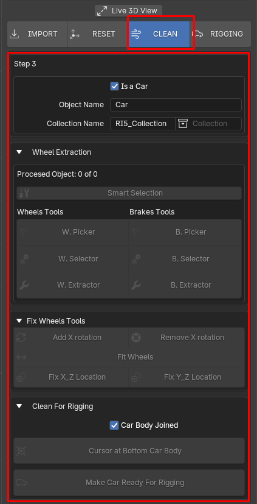

Here i will try to explain everything as best as i can, so this part will be explained step by step
because you need to understand what it going on in every action we make here.

### Rig in 5 Collection's Manager

This Sub-Panel is not only for set Object's and Collection's name here are happening a few more things
so pay atention to know what is happening underneath

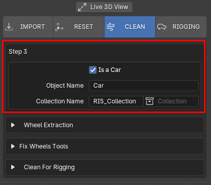

you can see an **Object Name Field** this property is dynamic at some point of the process
this field has the value ***"Car"*** by default as you see on the image above. you can change this value
by hand setting the name you want to type here like: ***"My Car", "Mustang", "Blender"...*** i mean 
anything you want to set as name for the model we are working on, We should use names that
make sense for us.

besides that this field could change with other actions, like it follows:

when we are making PC import: 

as you can see above when we make an import from our PC the **Object Name Field** change its Defualt Value ***"Car"***
to the name of the model imported in this Case ***"Creepers Truck"*** so from that point you can keep that name or type another one
you like most its up to you now. 

when we are making Sketchfab import: 

as you can see above when we make an import from Sketchfab the **Object Name Field** change its Defualt Value ***"Car"***
to the name of the model imported in this Case ***"2015 Bugatti Atlantic - Concept Car"*** so from that point you can keep that name or type another one you like most its up to you now. the same think happend when you import a model using the **URL** method

now a very important thing to know is the **Object Name Field** is also the name of the  **Yellow** 
collection in which will be stored our car ready to be rigged.

as you can see on the images above the Field will be the name for our  **Yellow** Collection in this case is a Mercedez-Benz car this is to preserve a coherence in our project an the naming for our model and keep things as organized as posible, So we can get a collection called **Mercedez-Benz [Joined Model](index.md#knowing-the-car-naming-convention) and its model inside is a Mercedez-Benz car parts and Rig with the same name.

Now how can we manage  **Blue**  collection, which is the container for our  **Yellow**  collections?:
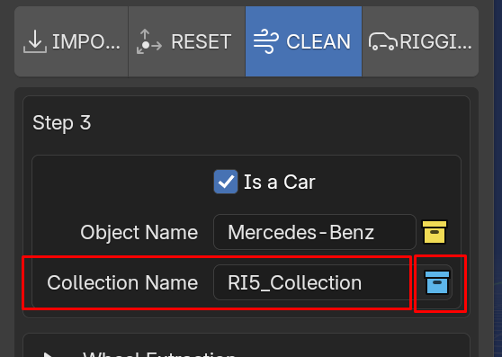

the **Collection Name Field** by default is ***"RI5_Collection"*** we can type any word we want here for each  **Blue**  Collection, so as you see in the images below:

what happend in the image above? we can change the name like anything in blender just typing what we want,
The special thing here is this field if you keep it as it is ***"RI5_Collection"*** or any ***"Custom typed name"***
also means for **Rig in 5** is the car we are working on will be stored in that collection with that name if exist else the addon will create a new one for us, Another important details as you can see  **Blue**  collection icon is where the created  **Blue**  collection will appear
listed so if we have two or more  **Blue**  collections you can choose in which of that listed
collection we gonna stored the model we are working. as you can see below:

Resume: Any new name setted in **Collection Name Field** means a new  **Blue collection**  this collection we can call them as **RI5 Container**, the Collection Blue Icon is a **RI5 Container List** where we can pick with ease to store our new **Yellow collection** with our new ready rigged car. 

### Extraction Wheels and Brakes System

I think **Wheel/Brakes extraction** system is the most complex feature to be explained because me as programmer
implement many tricky ideas to achieve the task i imagined for this tool but also is the most exciting 

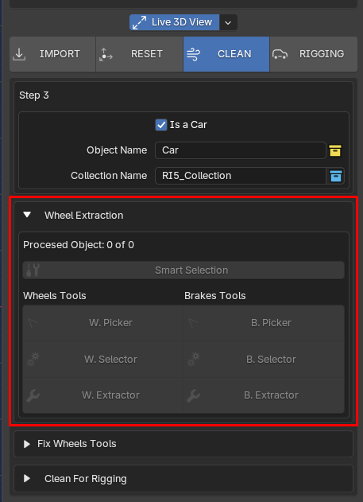

When we import an sketchfab model some of them comes with some naming convention that we can use
here i will show some of those different cases:

#### Sketchfab Heriarchy

we need to understand how sketchfab manage each model so when you get a model from it you already know what to expect.

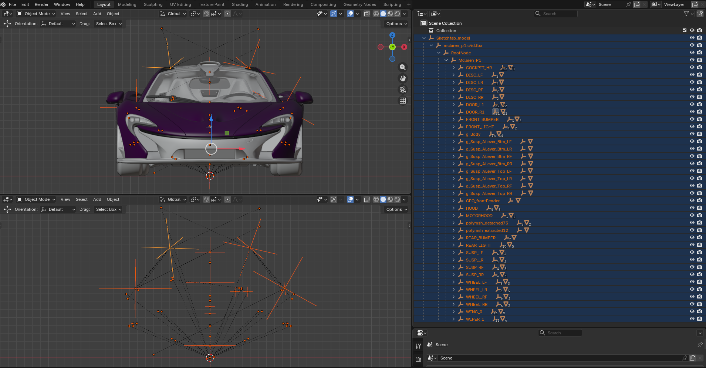

**1) Scene hierarchy in Sketchfab.**
Sketchfab converts models to its own node-based scene system (similar to a scene graph).

When you upload a model with multiple parts (e.g., a character with clothing and accessories), Sketchfab preserves the original hierarchical structure, but may convert complex transformations or groups into empty nodes (“empty objects”) to maintain the relationships between objects.

**2) Exporting from 3D software** 
If you have organized objects in your 3D software (Blender, Maya, etc.) into “groups,” “empty parents,” or “nulls,” Sketchfab interprets them as separate nodes.

When downloading, Sketchfab can export that hierarchy as is, generating empty nodes to maintain the structure (especially in formats such as .gltf/.glb).

**3) Download format**
Formats such as .glb or .gltf (Sketchfab's native formats) usually include the complete hierarchy, including empty nodes.

If you download in .obj, the hierarchy is “flattened” (you can avoid empty nodes), but information about materials, animations, or nested transformations is lost.

**4) Sketchfab processing**
Sketchfab automatically optimizes models for its web viewer, sometimes adding empty nodes to:

* Control transformations (rotation, scale) of groups.
* Separate meshes by materials or LODs (Levels of Detail).
* Preserve pivots (transformation origins) of objects.

!!! tip "Technical Note"
    Empty nodes are common in professional 3D pipelines (e.g., for animation or organization), but if your model is static, you can safely remove them. Sketchfab includes them to preserve fidelity with the original file, even if they have no geometry.

Most of the time we gonna pick car model to work with and not always the authors of that model are [**organized ( Sketchfab Heriarchy > "2) Exporting from 3D software" )**](#EF3S) or work under
a naming convention and identify any car piece they've modeled for that we need as a good practice know this behavior
and check the model on the outliner an see how is structured so we can know how to proced.

as you can see below we have a model pretty dense geometry or car pieces: 

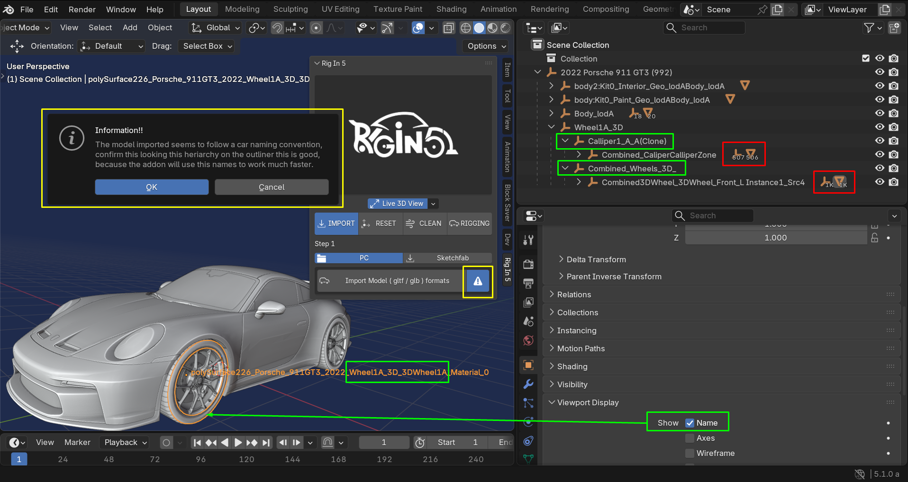

*  **Advise Model Button** : just telling us what is the condition of the model, Awaring us if the model 
has naming convention by default in this case this True so checking on the outliner we can see better

*  **Show Name** : by activating show name we can see that one of the object of the wheel has
the word ***"Wheel"*** twice in its complex name: 

    **(polySurface226_Porsche_911GT3_2022_Wheel1A_3D_3DWheel1A_Material_0)**

    |"|Detected|"|Detected|"|
    |:----:|:----:|:----:|:----:|:----:|
    |(polySurface226_Porsche_911GT3_2022_|**Wheel**|1A_3D_3D|**Wheel**|1A_Material_0)|

* **Wheel Pieces Amoung**: this model come with 1k wheel parts and 500+ brake parts this is a really nightmare to manage by hand using the default Blender selection tools and join everything then type a conventional name by hand for each Wheel, a very boring task!!

so the addon automatically detect this situation for us when we imported the model, it is important mesh names comes with any of the Internal Word List as part of a expected naming convention that's why the advise button tell us in its Info Box The Following:
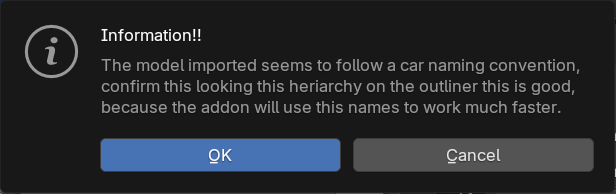

!!! info "Internal Words List for an Expected Naming Convention"
    | Words To Detect Wheels | Words To Detect Brakes |
    | :---- | :---- |
    |'Wheel','wheel','WHEEL'|'calliper','Calliper','CALLIPER'|
    |'Wheels','wheels','WHEELS'|'callipers','Callipers','CALLIPERS'|
    |'Tire','tire','TIRE'|'caliper','Caliper','CALIPER'|
    |'Tires','tires','TIRES'|'brake','Brake','BRAKE'|
    |'Tyre','tyre','TYRE'|'brakes','Brakes','BRAKES'|
    |'Rim','rim','RIM'||
    |'Rims','rims','RIMS'||
    |'Disk','disk','DISK'||
    |'Disc','disc','DISC'||

    !!! tip "Future Update"
        I will making this list be dynamical in futures updates of the addon, so we will be able to save new words in each list
        any time we work on a model with some new naming convention we don't know yet.

so the RULE to follow here to know is when we import a model that looks roughly like this from here: 
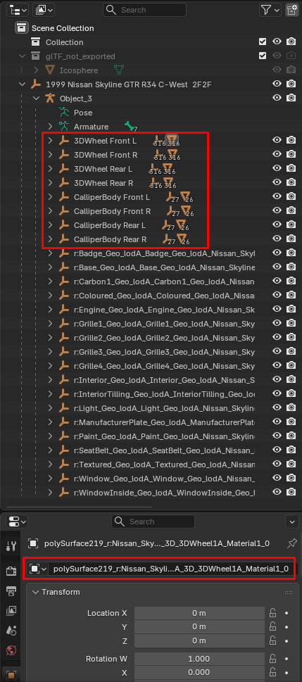 
We need make sure that the model has Meshes which in its name exits some of the **Internal Words List for an Expected Naming Convention** to be detected

but if we get model that comes with the condition above this is what we can make: 
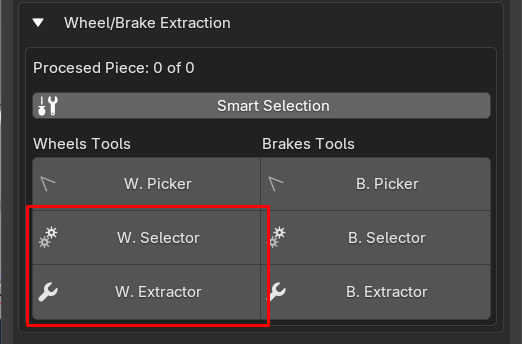

#### **W.Selector / B.Selector, W.Extractor*/B.Extractor***

By pressing **W.Selector** Start the selection of all **Wheels Parts** detected ready for the next Step 
Which is **W.Extractor** Start to get all the selected **Wheels Parts** out of the Sketchfab_model heriarchy  
base on the Following: 

!!! Tip "**World Axis Reference:**"
    by detecting the position of each wheel parts the addon will join all the pieces to build a **Wheel**
    if its position is in **(+X, -Y) Axis** match to be the
    **Wheel.Ft.L** for example.
    so it will creates its name taking the position of that new joined wheel in World Axis and create the 
    corresponding name for it, this will happen for each wheel.

    
    
    
    
    

**knowing that RULES this is how process looks:** 

I know this is pretty crazy and may be diffcult to understand at the first time
so i recommend check this specific tutorial guide about this part ---> **[Wheel/Brake Extraction Guide](https://www.youtube.com/).**

#### **W.Picker / B.Picker**

Now let's talk about a feature we haven't mentioned yet which is **W.Picker / B.Picker**

this is a modal operator what it does is when we have an active object on the scene and press for example
**W.Picker** start a detection feature that actually will be running when the mouse cursor is above of that active object (MESH)
when this happen the model will enter in Edit Mode automatically at this point we are running an automated linked selection system

this is a convenient and fastest way to select islands of a car model that we need separated like the wheels and brakes
so imagen you've downloaded a car model in which every pieces is part of the same Object we need to separated any island that shape the wheels and any island that shape the brakes or any island related of this two car pieces, like Rims, Tires and so on!!

here is a quick view on how to know the modal is running:

Once the modal is running we can use the native linked selection operators of blender automatically just
hovering the mouse cursor over the island you want to be separated but before let's see another cool features
while all this happening by Right Clicking a **Pie menus Call "Mesh Select Mode"** will be displayed, there you can choose between Vertex,Edge and Face Selection modes **(Left Options of the Pie --> "Context Selection")**, So: 

* if you are in **Vertex** mode for example a bunch of other options will be available in **(Right Options of the Pie --> " Vertex Select Similar")**
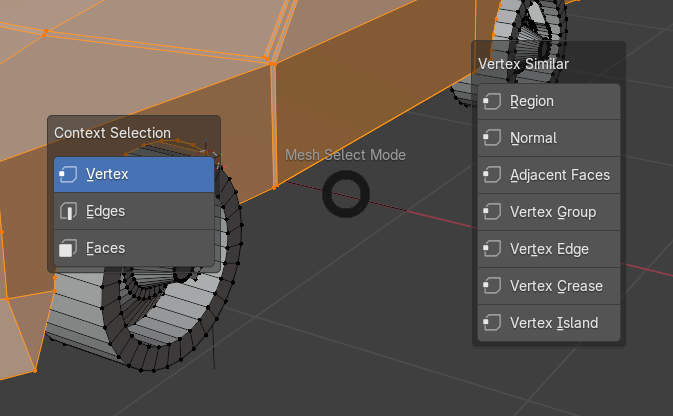

* if you are in **Edges** mode for example a bunch of other options will be available in **(Right Options of the Pie --> " Edges Select Similar")**
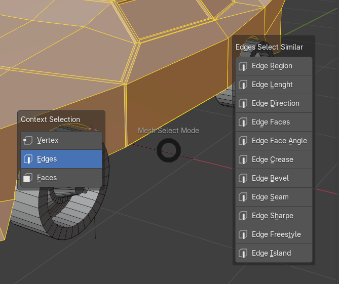

* if you are in **Faces** mode for example a bunch of other options will be available in **(Right Options of the Pie --> " Faces Select Similar")**
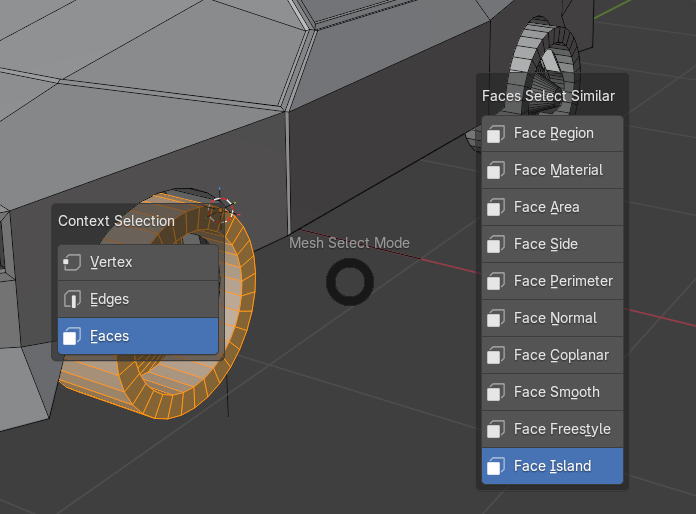

as you can see below:

It is possible to use the blender native way to change between selection modes using number keys on your keyword as follow:

Now let see how to separate the islands because that the main target here, so when we hover the mouse cursor over an island
this will be selected automatically as we already now and by just Left Clicking in our mouse that island will be separated.

as shown below:

what is happening above?:

**Red Box:**: telling us we are running in this case **W.Picker** and print the mouse cursor coordinate on the 3D View

**Green Boxes:**: Shows what happen when **Mouse-Left-Click** extract the island under the mouse cursor and add as suffix the word wheel and Enumerate to that new object ---> "Cube_wheel.(n+1)", so we are extracting islands we identify as wheel part this feature will be pretty useful in a most complex model.

**Yellow Box:** Shows the Operator Report of the Modal Operator with info saying we have finished our picking wheel parts job 

!!! info "Info!"
    if we want to do the same for extracting island we identify as brake pieces we should use **B.Picker**
    and when this island are extracted they gonna have instead the word "_wheel.(n+1) as suffix" here 
    the word will be "_brake.(n+1)" in this case should be like it follow ---> "Cube_brake.(n+1)"

here is a full example where wheel/brake islands are extracted:

!!! tip "One Minute Car Rigging Showcase"
    You can see how we can get a One Object with many islands get Ready Rigged in just one minute!!
    this gif below shows a realtime process 
    

**Resume:**
!!! info "Reset Tab"
    **Fit Model**: I used this operator to create a Temporary "Sketchfab Heriarchy" so the addon can know how to process this custom model

    **reset World position**: now this operator can reset the model over the plane (X,Y) which means over the "Ground"

!!! info "Clean Tab"
    **W.Picker / B.Picker**: I kept every value in the collection manager by default and take action in the extraction features directly, As we already know this model contain all its pieces as a single object, that's why we need to use the Picker Options to split the model. taking out islands shaped as wheels and brakes.

    **W.Selector/B.Selector**: we basically at this point have model with a rough naming convention because W.Picker/B.Picker set suffix in the new objects created when islands are extracted so the operator can now recognize an select those "Wheels" and "Brakes" for us.

    **W.Extractor / B.Extractor**: having the selection done we can now press to extract the Wheels and Brakes respectively.

    !!! warning "Keep in Mind"
        it is recommended to do all related to the wheel first and the repeat all for brakes that why the addon has this section divided for each pieces

    **Cursor at bottom of the car's body**: i'm set the cursor at bottom of the car's body, i'll give deep dive on this later on.

    **Make Car Ready For Rigging**: here finally we prepare the model building all the pieces like: Body, Wheels and Brake, create the  **Container Collection**  and the  **Sub-Collection**  to store our car there.

!!! info "Rigging Tab"

    **Create Car Rig**: by press this operator the addon will creates a Car Meta-Rig positioning each bone based on the origin of each car piece, so Body bone will be positioned at the origin of the mesh that has the word body in its name and so on.

    **Create Control Rig**: Finally by pressing this operator the addon will create all the rig mechanism and controls with customs shapes for us and apply a test animation by defualt so if something went wrong with the parenting we can see it at that point and go back to repeat the earlier step ***Create Car Rig*** and fix the issue there if needed 

### Fix Wheels Tools

This Tools are very easy to understand and they usage are pretty straight forward

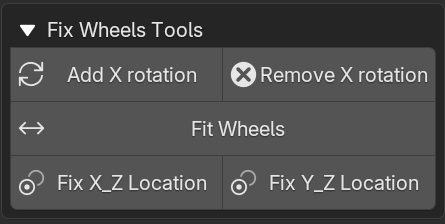

**Add X Rotation**: This tool will add an animation on the X axis of the wheels we have selected, this is pretty useful because we can detect some problem on the wheels if these have little rotation we don't see with a naked eye. 

!!! tip "Tip"
    you can select all objects in your scene and the animation will be applied just to the **Wheels**

#### **Remove X Rotation**: 

This just Remove the animation we add with ***Add X Rotation***

take a better view here: 

#### **Fit Model**: 

With this tool we can fix some issues normally present in the front wheels using as refence back wheels

take a closer look in the following example: 

#### **Fix X_Z Location**: 

This allow us to perform an aligment action between two wheels on the Front View.

as you can see here: 

#### **Fix Y_Z Location**: 

This allow us to perform an aligment action between two wheels on the Side View.

as you can see here: 

### Clean For Rigging

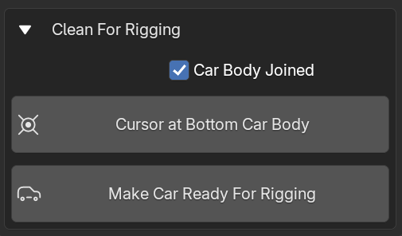

#### car's body Joined

Let's talk about **car's body Joined** this property allows us to keep or not the car's body pieces joined or not
this can be pretty useful if you want to add another layer of complexity to rig to other pieces of the car's body like the doors, steering wheel... and the rest of the pieces that can be animated in that case we should keep this property deactivated but if you just want to keep thinks simple and your target is to pose the car for static renders or create y simple car chase where this pieces won't be moving during the animation keep this property activated. take a look to the examples below: 

!!! Tip "car's body Joined Activated"
    |  Convention Name     |  Description  |
    |  :----      |  :----        |
    | **[car]_jn_body**| this is the name assigned when all body parts are join as **One Object** |

    

!!! Tip "car's body Joined Deactivated"
    |  Convention Name     |  Description  |
    |  :----      |  :----        |
    | **[car]_sp_body**| in this case means the body parts are separated   making the active body father of rest of them |

    

#### Cursor At Bottom car's body

This feature allows us to reposition the 3D cursor based on the **bounding box** of the active object if we have just one object selected, if we have more than one object it will perform the cursor location calculation based on those selected objects bounding box prioritizing
the active object of the selection to calculate the lowest vertex on Z-Axis to get the cursor at bottom of all selection

Thanks to this behavior, we can define in which part of the car's body we will place the Body Bone that will control all parts of the car's body, obviously excluding the wheels and brakes.

basicaly using this operator we can define where we want the Body Bone to be positioned on the car with easy.

#### Make Car Ready For Rigging

Now with **Make Car Ready For Rigging** we finally are able to rid all that Emptys Heriarchy we don't need and build the Collection
predifined for us when we set  **Object Name property**  and  **Collection Name property** [**HERE**](#NS)

