# Rig In 5 (Import Tab) **[watch in Youtube](https://www.youtube.com/).**

Once you have installed the addon this is the panel you'll see by default, The **import** Tab 
is active logically because this is the first step we need to do to start any car rigging process, 
if you are working on your own model instead or make another importation using the blender files  
imports like, **FBX, OBJ, USD**... and so on!! you can skip this tab... and start your process on **Reset** Tab.

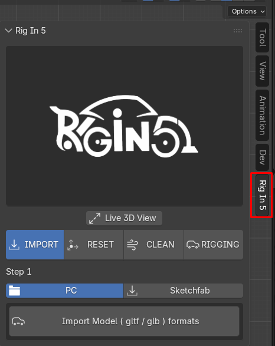

## Import from PC

to import from our PC activate the PC Sub tab. there we just have one Operator 
call **import model ( glb / gltf ) formats** as shown below

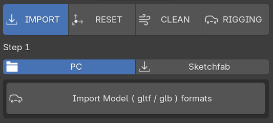 
when clicked! this launch a blender's **Import Helper Windows** where we can choose our Downloaded car model 

as you can see below.
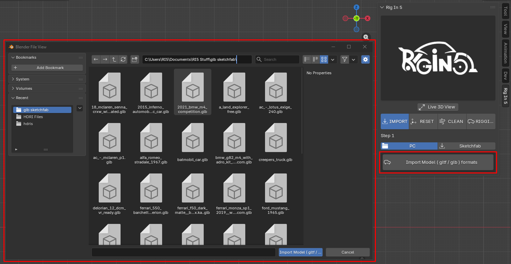 

in this case i've import the [Police Raptor](https://sketchfab.com/3d-models/ford-f150-raptor-police-840ede58ed40499a9cf332e25129f0b2) car which i've downloaded earlier from sketchfab page 
<iframe title="Ford F150 Raptor Police" frameborder="0" allowfullscreen mozallowfullscreen="true" webkitallowfullscreen="true" allow="autoplay; fullscreen; xr-spatial-tracking" xr-spatial-tracking execution-while-out-of-viewport execution-while-not-rendered web-share src="https://sketchfab.com/models/840ede58ed40499a9cf332e25129f0b2/embed"> </iframe> 

inside Blender this is what we get.
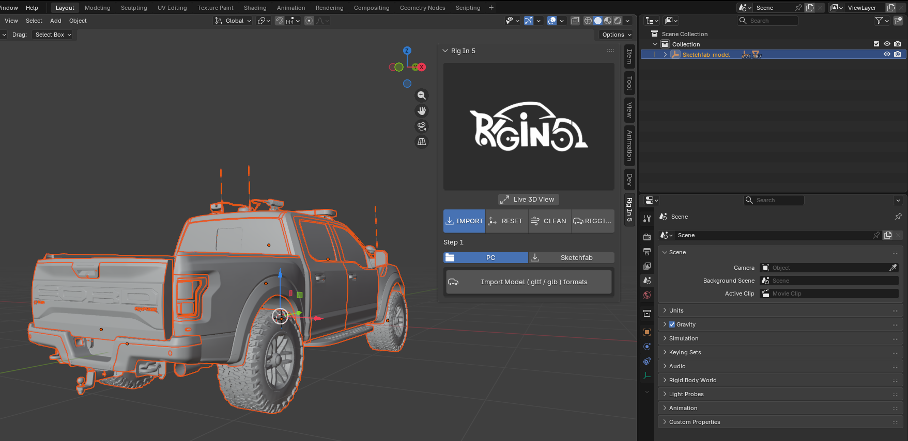 

## Import using Sketchfab API

by clicking the Sub-Tab "Sketchfab" as shown below , we can see more tools to make our car imports
here i reimplement another **sketchfab API** **to connect your sketchfab account with blender** i kept
mostly the same GUI that we can see on the [**Sketchfab Addon**](https://github.com/sketchfab/blender-plugin). the main difference is that here on Rig In 5
we just can search and import car models by default, if you want to download other type of model you need
to **deactivate** the property **Is s Car** we found on the **Clean Tab**, this will explained in details there.

**Is a Car** property on the Clean Tab
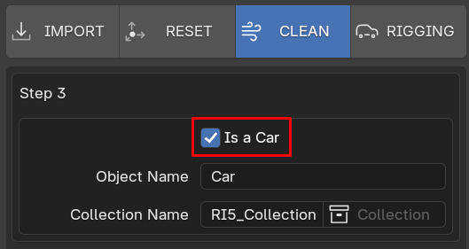 

as you can see in the image below activating the **sketchfab** option we have many options
like activate the addon, import from URL, a search text field to type whatever we want to search
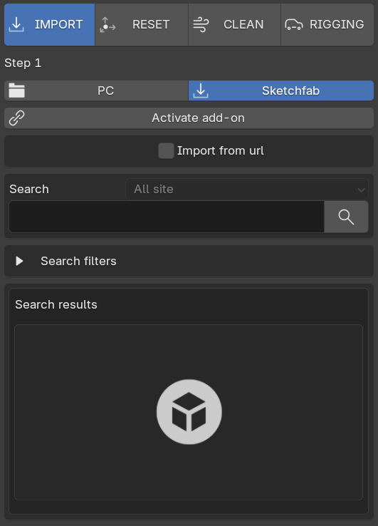 

before to do anything we need to activate the addon clicking the corresponding Operator 

pressing "Activate add-on"
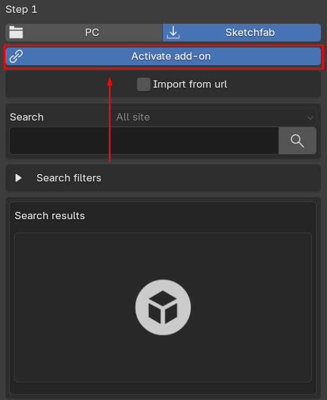 

once you do that you can Used **two ways** to connect your Sketchfab account with Rig In 5 
and start download model from the sketchfab platform within blender directly to you Scene 
by default to property **"Use mail/password"** is activated so you can provide your sketchfab 
Login Email and Password here to connect.

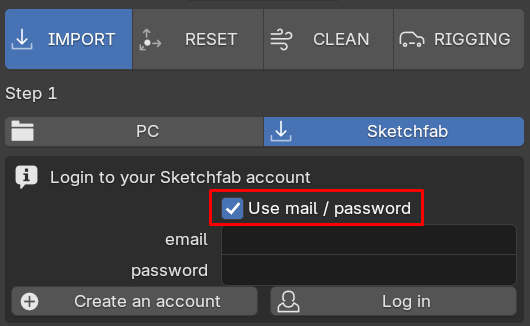 

if property **"Use mail/password"** is deactivated you are telling the add-on to used other way to connect 
which is Using "Api Token" that sketchfab create for us when we make a new account.  
the Api Token can be found this way go to **My Settings -> password & api -> API token**  
 

copy that API Token from the sketchfab page and paste here them press **Log in** 
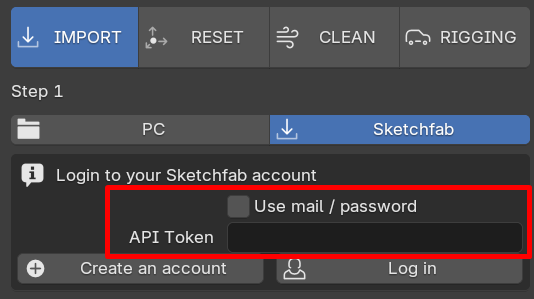 

Once you logged this is what you get, so now you can search the car you want to Rig! 
to keep this guide aligned let's used the URL import type.
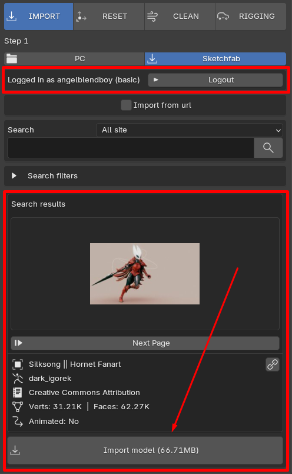 

### Sketchfab imports by URL

to use URL imports we need to activate **"import from url"**

import from url deactivated 
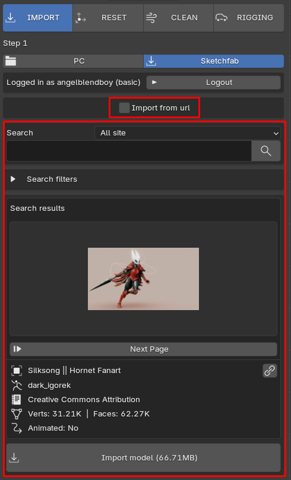 

as you can see above while **"import from url"** is **deactivated** the addon shows us a full 
features to search with that can display thumbnails of the model provided from internet 
even details like Name, Author, Licensing, Geometry Data which is cool because we can 
see what we are downloading with ease just in Blender UI. 

now if import from url is **activated** we only get a URL textfield to be fill 
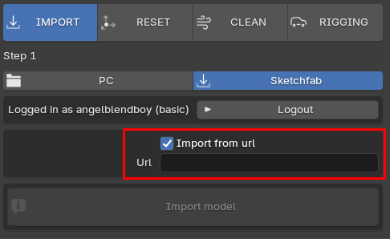 

so in our browser, we need to copy the URL of the model we we to import to our scene in blender 
just like shown below: 
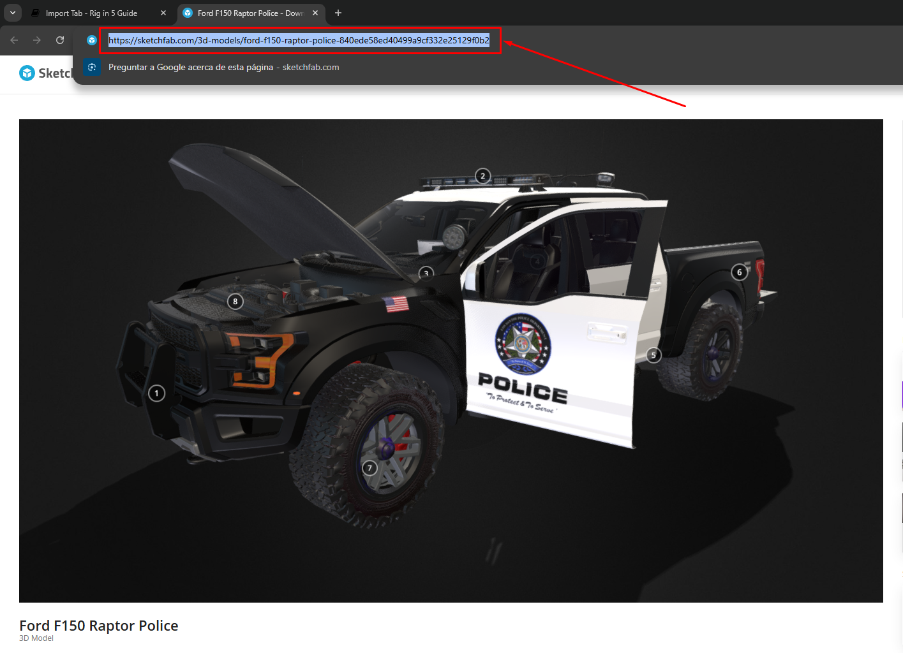 

and paste it here, and when you press import button you done, 
now that model would be downloaded directly from sketchfab page to you blender scene. 
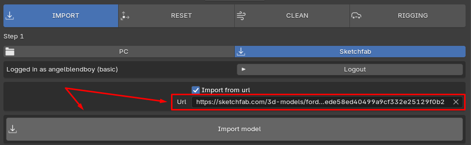 

Result: 
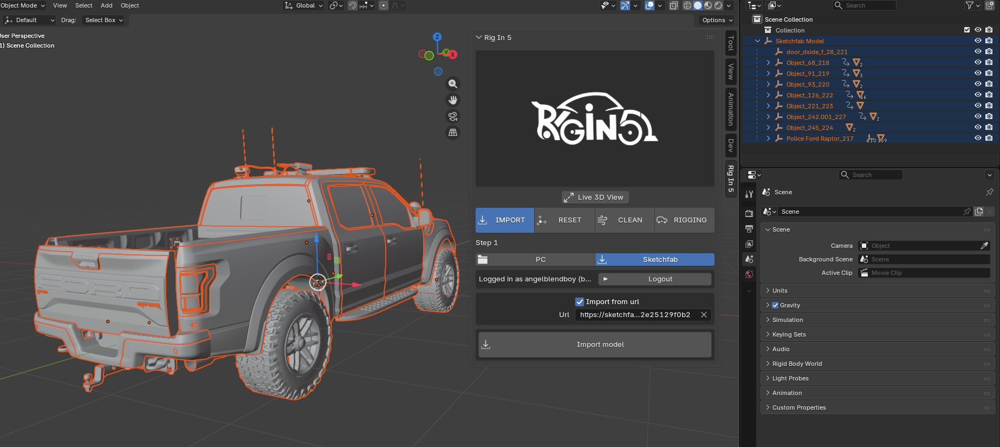 

### Sketchfab imports by Search

now lets make an import using from blender itself without the need to go to a browser 
for we make sure to deactivate **"import from url"** to see panel we saw before:

this one from here: 
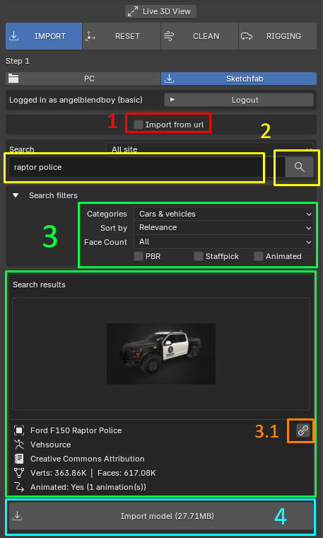 

Steps Followed on above images: 

1) deactivate **Import from url**

2) type the of the model you are looking for like this example **"raptor police"**, then clean search button

3) if you want can use the filtering features shown to get a more accurate result. pick **"cars-vehicles"**

this are all the filtering option available: 
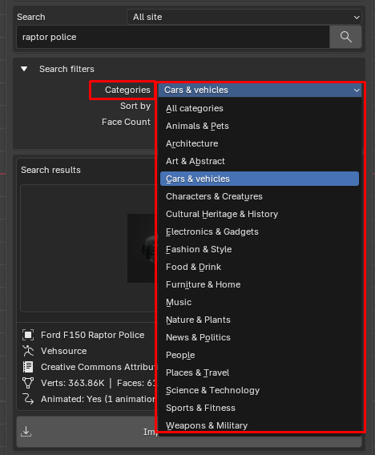 

as you can see a model thumbnail that will help us to recognize the model we want 
if you click the thumbnail a list will popup showing us more options if these ones exist 
as searching result like are shown here: 
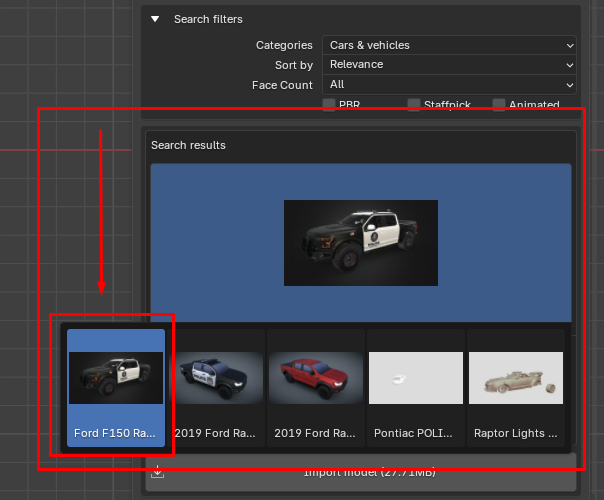 

3.1) the button with chain icon will open your web browser taking you to the exact model on the sketchfab page 

4) pressing **import model (file weight)**. start downloading the **"raptor police"** model to your blender scene, 
keep in mind depending the model size or weight this process can take some time.

## Great Free Car Resources on Sketchfab

i want to shear some of the best sketchfab Car Artist that you need to know.

[**Ddiaz Design**](https://sketchfab.com/ddiaz-design/models), here you can find really good car model 
that are **really easy to rig with Rig In 5**. i just love rig his cars for that. 
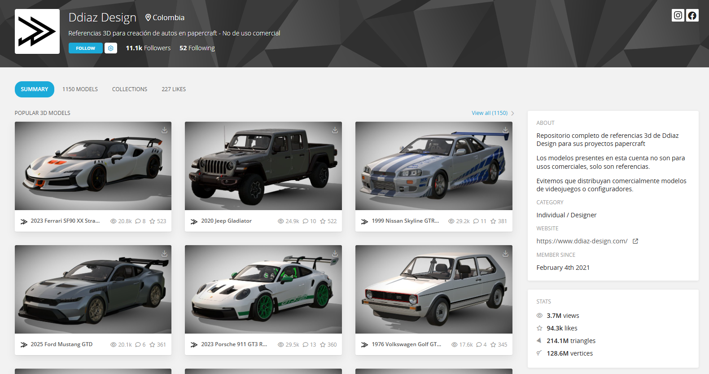 

[**ᗩᒪE᙭. Kᗩ.**](https://sketchfab.com/Alex.Ka./models), 
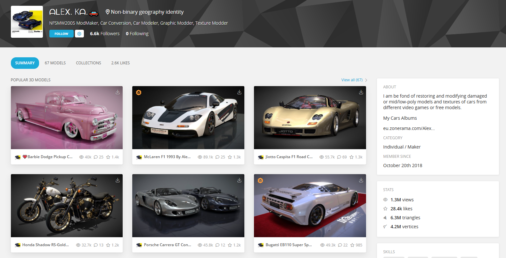 

[**Outlaw Games™**](https://sketchfab.com/Outlaw_Games/models), 
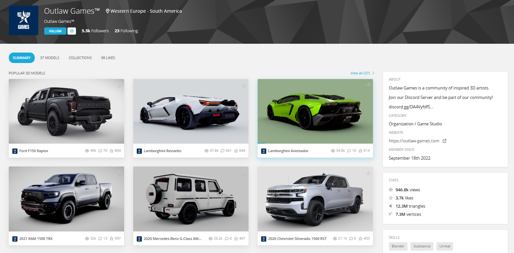 

[**OUTPISTON**](https://sketchfab.com/outpiston/models), 
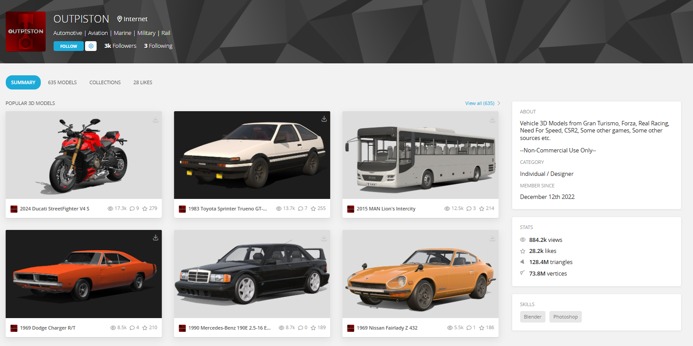 

[**SDC PERFORMANCE**](https://sketchfab.com/Lambo_SC04/models), 
 

[**vecarz**](https://sketchfab.com/heynic/models), 
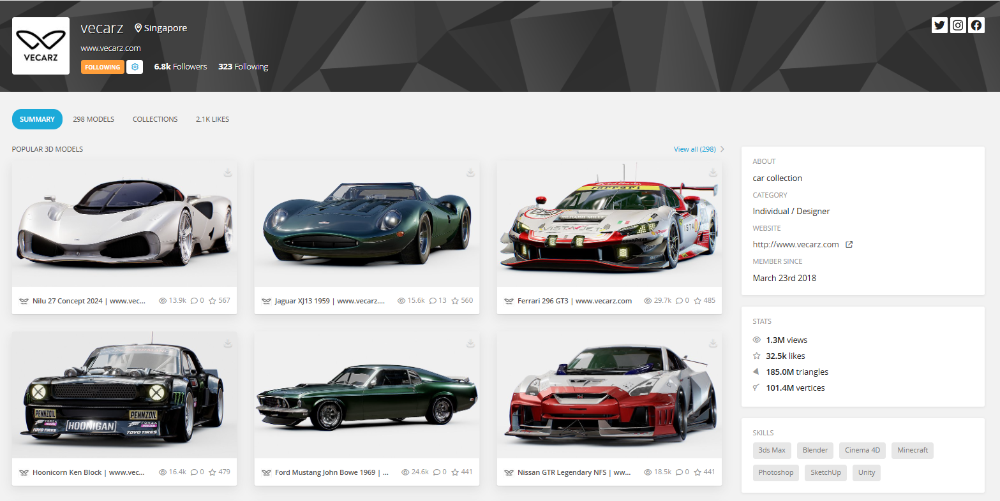 

