# Rig in 5 Introduction <!--**[watch in Youtube](https://www.youtube.com/).** -->

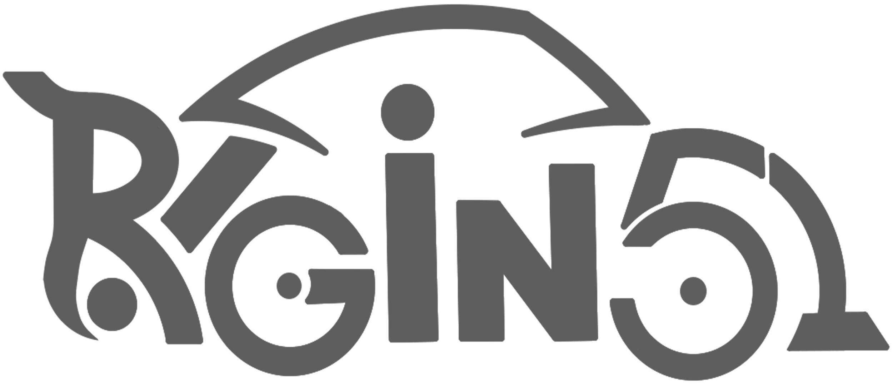

**Rig in 5** pretend to be a faster solution to manage almost any car rigging process for **Blender**.

with a simple workflow that i've found while working in **Blender** cars animation projects.
this guide has the porpuse to show you all necessary tips and tricks that are important to know while working with it.
ones you get the main idea behind rig in 5 you will be able to rig any car you want 

also check the --> <!-- *[Rig In 5 Tutorials](https://www.youtube.com/).* on Youtube. -->

## Concepts you need to know

**Rig in 5** what it does is import car models from sketchfab especially but not exclusively, clean that
sketchfab empty heriarchy which is a headache to manage when our target is Rig the CAR, Extract Body, Wheels and Brakes
of the car building the naming convention needed for car Rigging
used for **Rigicar** workflow which i've reimplemented to work with the newer
blender version so now works from **3.6+** to **5.0+** blender Version and was packed in the addon itself resulting 
in a more convenient Addon Panel making a much faster car rigging workflow.

!!! Info "Note"
    This workflow is for standar 4 wheels cars, 
    I will be working on how to use other car types as trucks
    that comes with back wheel pairs. 

this is how looks the new rigacar  
implementation inside Rig In 5 Panel.  
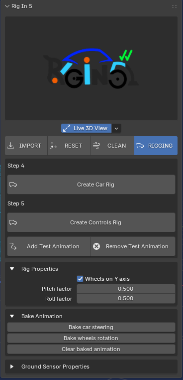

### knowing the car naming convention

the Resulting naming convention we get after using the addon should be like this:

!!! Tip "Convention Naming Table"
    |  Convention Name     |  Description  |
    |  :----     |  :----        |
    | **[car]_jn_body** / **[car]_sp_body**| this means that all object named like this is a Body Car |
    | **[car]_Wheel.Ft.L**   | this is the **F**ront **L**eft wheel |
    | **[car]_Wheel.Ft.R**   | this is the **F**ront **R**ight wheel |
    | **[car]_Wheel.Bk.L**   | this is the **B**ack **L**eft wheel |
    | **[car]_Wheel.Bk.R**   | this is the **B**ack **R**ight wheel |

!!! Note "Note"
    that we have two different body names

!!! Tip "Convention Naming Table"
    |  Convention Name     |  Description  |
    |  :----      |  :----        |
    | **[car]_jn_body**| this is the name assigned when all body parts are join as **One Object** |

    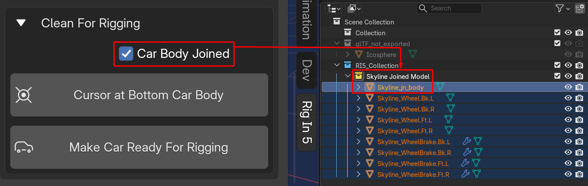

!!! Tip "Convention Naming Table"
    |  Convention Name     |  Description  |
    |  :----      |  :----        |
    | **[car]_sp_body**| in this case means the body parts are separated   making the active body father of rest of them |

    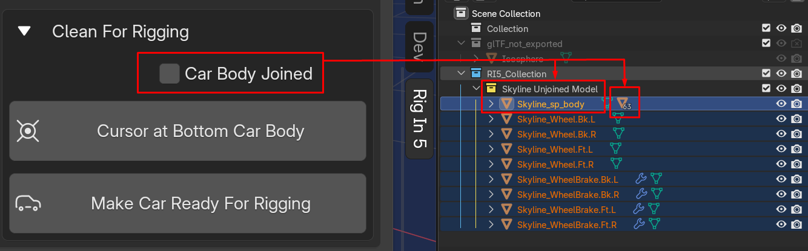

if the car comes with brakes it should be like this:

!!! Tip "Convention Naming Table"
    |  Convention Name     |  Description  |
    |  :----     |  :----        |
    | **[car]_WheelBrake.Ft.L**   | this is the **F**ront **L**eft brake |
    | **[car]_WheelBrake.Ft.R**   | this is the **F**ront **R**ight brake |
    | **[car]_WheelBrake.Bk.L**   | this is the **B**ack **L**eft brake |
    | **[car]_WheelBrake.Bk.R**   | this is the **B**ack **R**ight brake |

where **[Car]** can be any name, this can be setted by hand if you want
if is not the addon will used a defualt name **RI5_Named** when the **Object Name** field is empty
Now if anything before ins't the case the addon automatically use
the name of the imported model this will be shown on **Clean Tab**

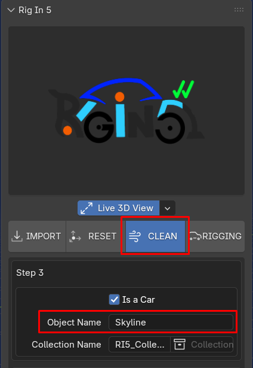

so, a full naming convention should look like this:

!!! Tip "Convention Naming Table"
    |  Convention Name  |
    |  :----  |
    | **[car]_jn_body** / **[car]_sp_body**|
    | **[car]_Wheel.Ft.L**|
    | **[car]_Wheel.Ft.R**|
    | **[car]_Wheel.Bk.L**|
    | **[car]_Wheel.Bk.R**|
    | **[car]_WheelBrake.Ft.L**|
    | **[car]_WheelBrake.Ft.R**|
    | **[car]_WheelBrake.Bk.L**|
    | **[car]_WheelBrake.Bk.R**|

here is a more graphics example:
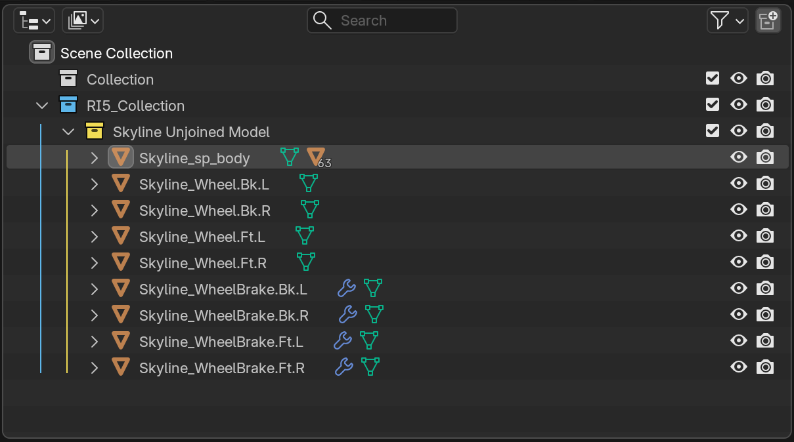

This is organized in Collection Colored in ***Blue*** and ***Yellow***,

*  **Blue**    --> collection works as a main container of yellow collections
*  **Yellow**  --> collection contain a ready rigged car we worked

if we see this result on the outliner inside a Collection ***RI5_Collection*** colored as **blue** and inside
of that collection should contain another collection Named as **[Car] Joined Model** or **[Car] Unjoined Model**  colored as yellow

as shown below:

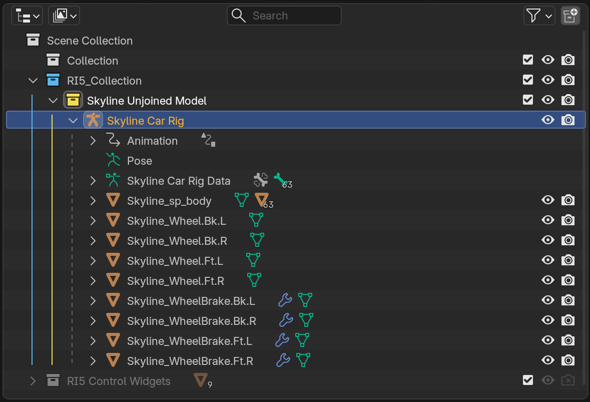

we can have many Collections Container (BLUE) and each one can also have many (Yellow) Subcollections 

here is an example of two collection one for Sport Cars another for Trucks. 
so you can pick in which you want to store sports an truck car, this will be explain in details 
in **Clean Tab** there is where "**Dense**" work happen.
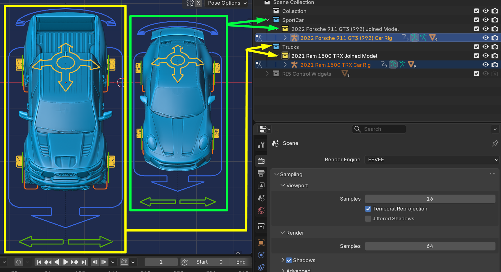

## Technical Concepts you must know

**Rig in 5** work based on world coordinates to execute the wheels and brakes extraction properly 
as soon as you can understand this you will master all the addon for sure and be the faster car rigger Ever!! 
so for that reason is why a added the Reset Tools, to manipulate our model much easy. 

but, let me show you some important concept 

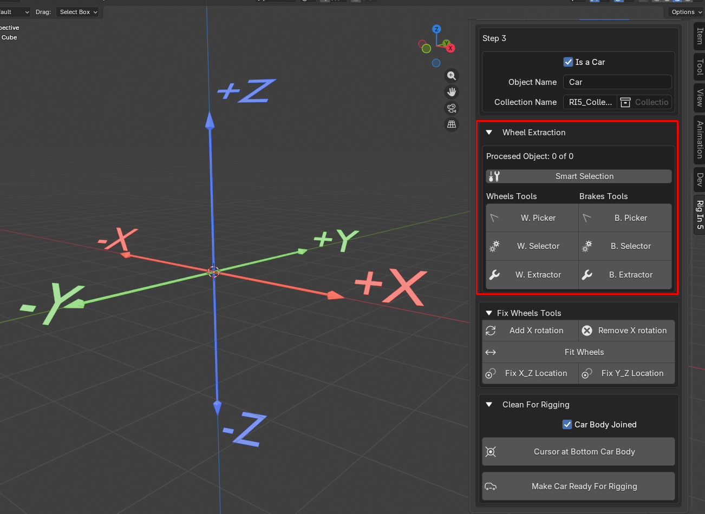

a proper car oriantation should be in **(+X, -Y)** where ***(-Y)***  
is the direction where front of the car model should be point at  
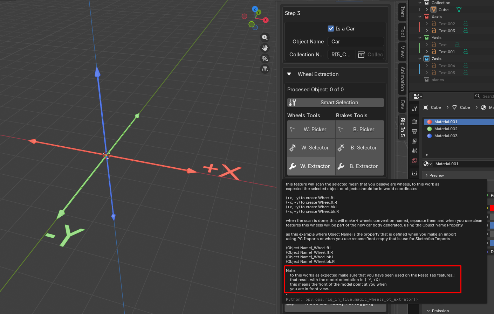
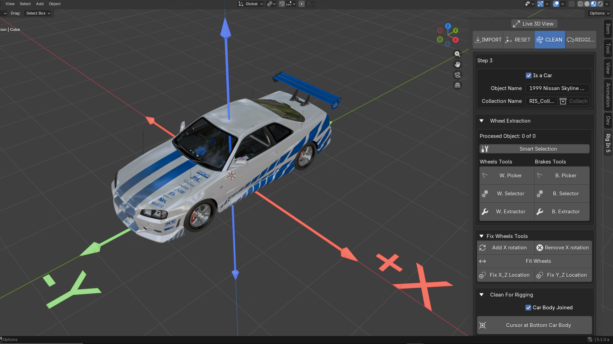
as you can see above the nose of the car is pointing on the ***Negative Y-Axis*** 
that's good because now we know the addon will recognize wheels and brakes as expected 

Once we have everything just like this you should know and understand the following rules 

wheel detection occure based on vertex world position of the geometry to define the conventional name 
if the model is between the plane inside **(+X, -Y) Axis** as shown below means that geometry 
should be a **Front Left Wheel** or **Front Left Brake** so the Name will setted as **Wheel.Ft.L** or **WheelBrake.Ft.L** 
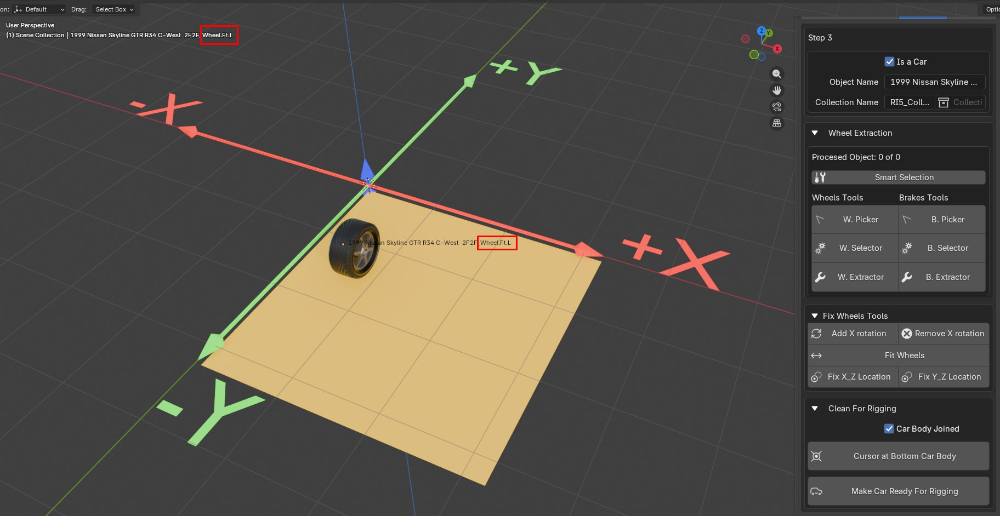

so in the case of the model is between the plane inside **(-X, -Y) Axis** means that geometry 
should be a **Front Right Wheel** or **Front Right Brake** so the Name will setted as **Wheel.Ft.R** or **WheelBrake.Ft.R** 

as shown below: 
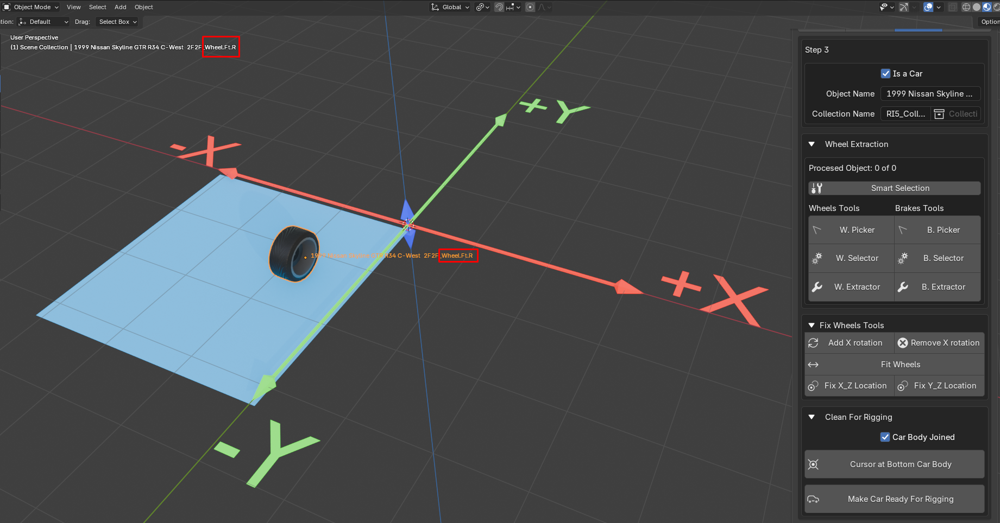

this will be same logic for back: 

for the case of **(+X, +Y) Axis** means that geometry 
should be a **Back Left Wheel** or **Back Left Brake** so the Name will setted as **Wheel.Bk.L** or **WheelBrake.Bk.R** 

as shown below: 
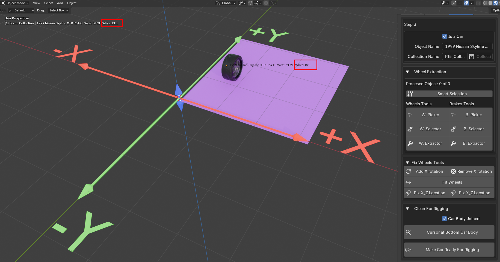

and Finally the case of **(-X, +Y) Axis** means that geometry 
should be a **Back Left Wheel** or **Back Left Brake** so the Name will setted as **Wheel.Bk.L** or **WheelBrake.Bk.R** 

as shown below: 
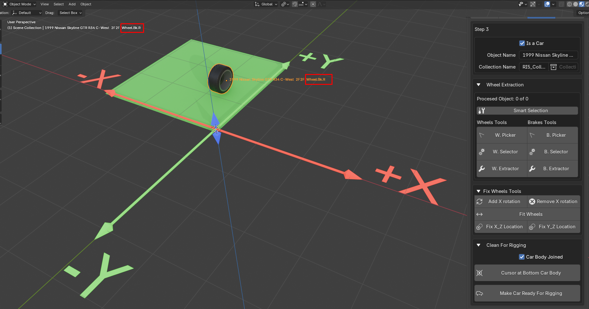

Rig In 5 will detect each wheel and brake and build the naming convention for you automatically 
the only think you need to aware of anytime you face an Extraction error is mainly we forget to Apply 
Transform a bad orientation an all that little details that always are important so make sure to use always 
Reset Tab Features to avoid that kind of issues. 
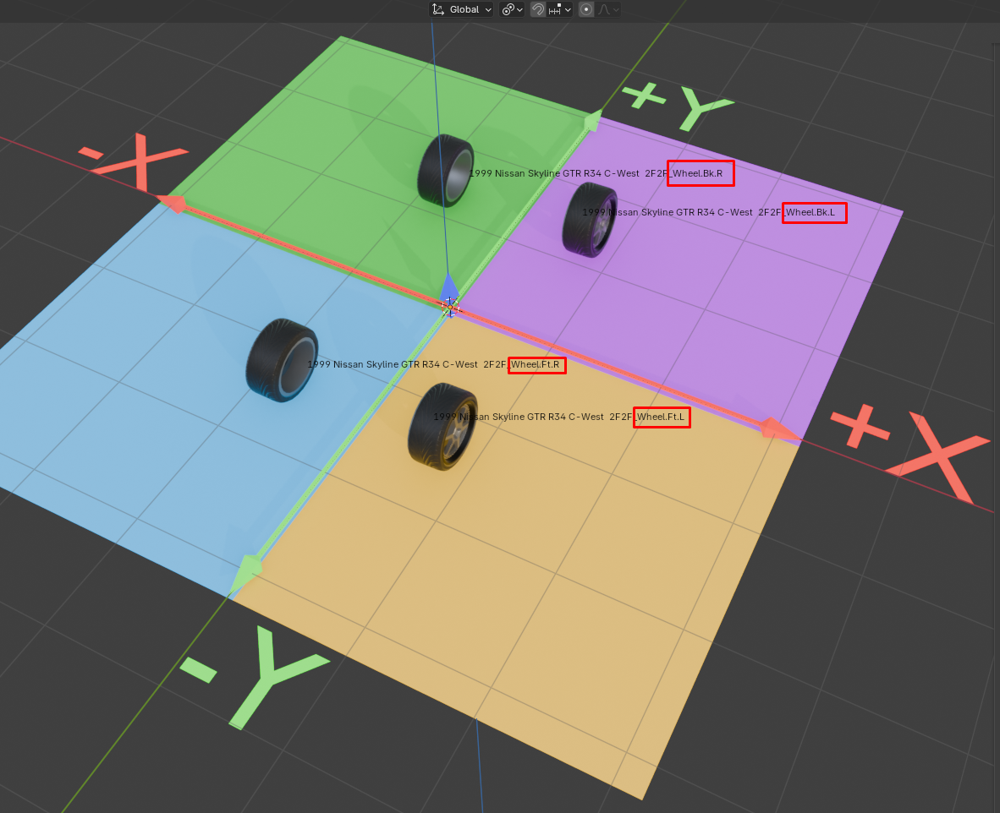

### **World Axis Reference:** 
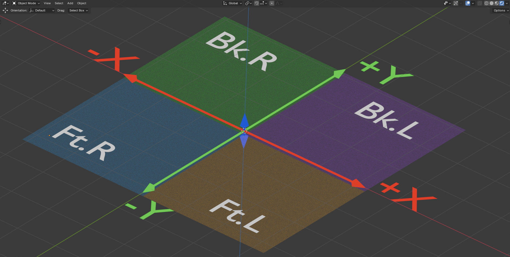

