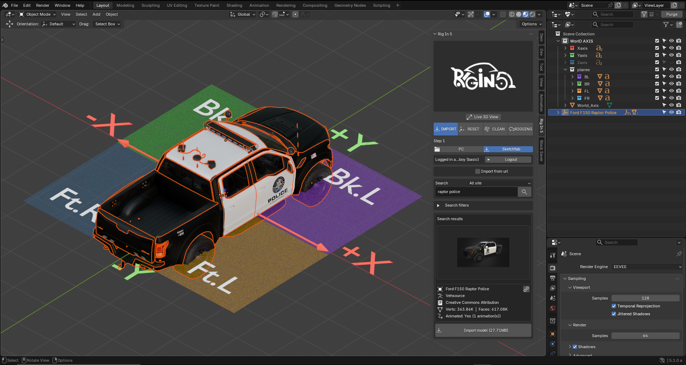
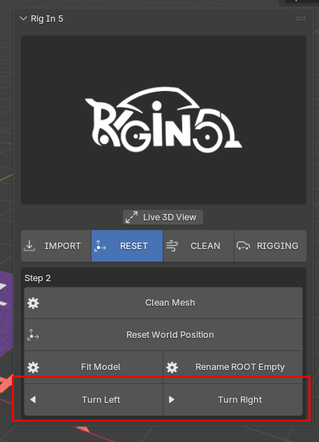
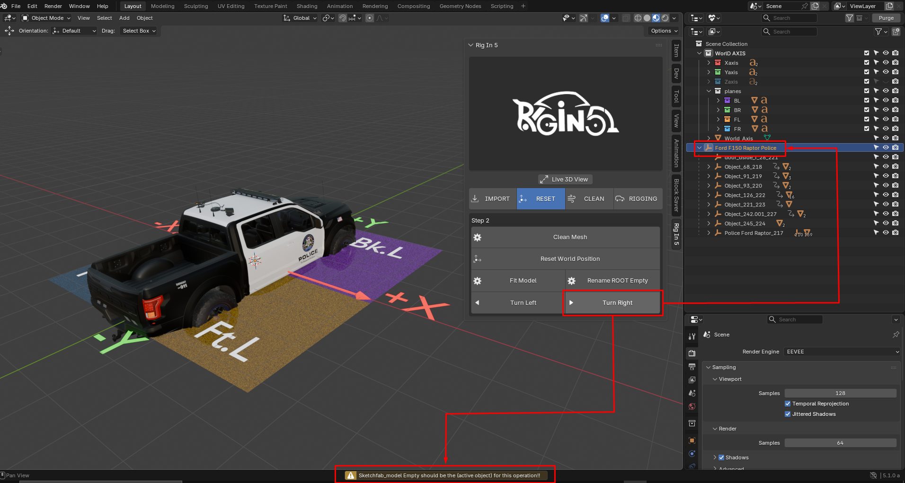
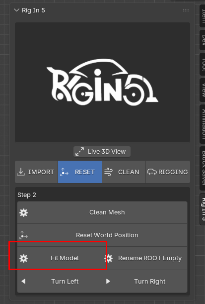
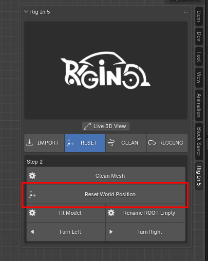
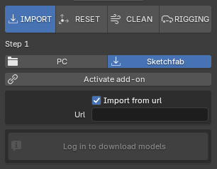
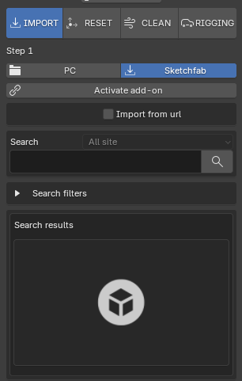
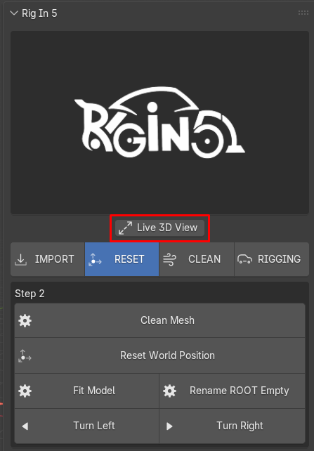
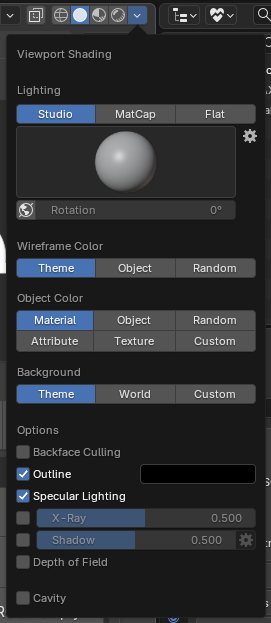
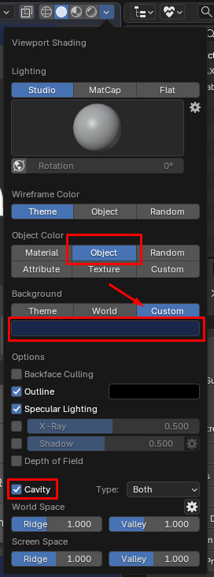

# Rig In 5 (Reset Tools Tab) **[watch in Youtube](https://www.youtube.com/).**

so, here we are!! now its time to talk about the **Reset Tools**, as i mentioned before 
the porpuse of this features are to manage more faster our imported model to be rigged 
to keep think organize i will work on the same **Police Raptor Car** Model imported earlier showed in **Import Tab** 

!!! Info "Note"
    I will Explain this Tools Panel randomly because this process doesn't need to follow a linear workflow
    with the exception you want to use the Turns Button which work under the condition that ROOT Empty need to have
    "Sketchfab_model" as name which needs to use **Rename ROOT Empty** this is explained below.

what can we see here? if we compare **World Coordinate Reference** and **Raptor Police Orientation** 
we can see the model has wrong orientation because the nose of the Raptor Police should be pointing 
at ***-Y*** not ***+Y***, so for this kind of issues we use the Turn **Left** and **Right** buttons 

as you can see below: 

!!! Warning "Keep in mind"
    if we press any of this Turn buttons could cause a **WARNING** like it shows the following image 

    

this is because here we need the ROOT Empty of the Police Raptor Car Model name as 
***Sketchfab_model*** instead of the original name which is ***Ford F150 Raptor Police***, 
we can achieve this typing it by hand (a Boring Task) or by clicking **Rename ROOT Empty**  
that is the only porpuse of this Operator, result is we save time avoiding to type it by hand: 

Once we solve that Naming "rule" we can now fix the Raptor Police Orientation with easy 

Fixing the model Orientation with 90 degress rotation:

after that in this case which is perfect to show the next Button call **Fit Model**

this operator is a bit more complex than just change the name of an Empty
what it does create a new ROOT Empty base on bounding box of the **selected object** in our scene
we only need always keep as active object one object ***"Wheel"***, i mean object we recognize as wheel shape
**why?**, because this new ROOT empty created will Replace the Original One, positioned in the Lowest Vertex and Centered
in the bounding box of the selected objects, so we this we can move all the model pieces an putting
the plane(x, y) where this work as the ground of the world.

to see this better let see the World Axis Reference we already have in the scene as the ground
so the Raptor Police should be over this, as shown below:

here is a closer view to see what is happening and taking a closer look, you may notice
i used the Operator Twice because is flexible and you can used this as much as need
to get the better result, which mean get that New ROOT empty as centered and align with the line
where the "***WHEELS***" will be touching the ground

Now we can use Reset World Position and what it does is Apply the transform to the entire Empty Heriarchy
so to see better which is the convenient in the case of our Raptor Police model is what you can see below:

by using the **"Reset Wolrd Position"** we can position the model above the ground in this case
I said the ground is the World Axis Reference which is already in our scene:

!!! Warning "Keep in Mind"
    Always use the **"Reset World Position"** in any case before to proced with the Tools on the **Clean Tab**!
    if the model imported comes in perfect condition you should apply all transform so keep this in mind
    **"Always use the Reset World Position"**

!!! Warning "Keep in Mind"
    Also use the **"Rename ROOT Empty"** when imported model was using Sketchfab Import in both cases
    if the method used was by URL or by Searching Tools 

    | Import by URL |<>| Import by Search |
    | :----: || :----: |
    ||<>||

Now Finally lets talk about  the **Clean Mesh** Button

if we want to see better what Clean Mesh does we need to activate a property we don't mentioned yet
because in our process we don't need to until now, what is that property? well the **Live 3D view**

Activating Live 3D View: 

when we activate that property what happen is blender run a bunch of shading option at once for us: 

!!! Info "Shading Options"
    
    | Defualt Shading Setting |<>| Live3DView Shading |
    | :----: || :----: |
    ||<>||

now with live 3D View shading setting applied we can see better the shading issues that could come with the model we imported
this is just to keep thinks clean in terms of geometry because this just do the following: 

!!! Info "Clean Mesh Actions"
    * Convert Tris to Quads
    * Remove Doubles
    * Flip Normals and Reset them
    * Apply Shade Smooth

    

    

!!! Warning "Keep in Mind"
    **Clean Mesh** not always result as we want, the result will depend on how good is the model imported 
    so in some cases could be good in other not much its usage it will be up to you!! 

    **Clean Mesh** causing shading issues 
    

!!! Tip "Info"
    I will add a more flexible approach in this Operator because maybe we don't want this 5 operation occure at the same time
    maybe we just need 1,2 or 3... of them, So i will try to implement a popup menu where we can activate or deactivate to be executed

