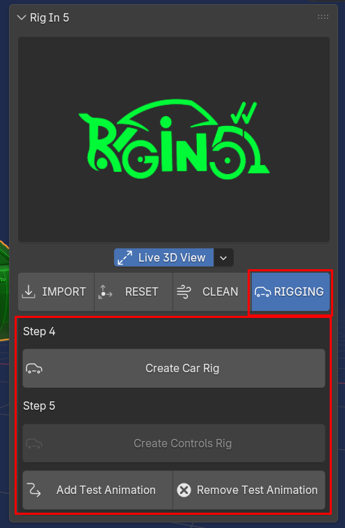
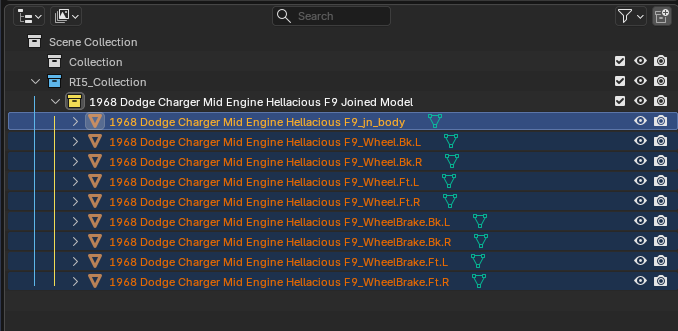

# Rig In 5 (Rigging Tab) **[watch in Youtube](https://www.youtube.com/).**

Now it is time to get the car Rigged and this is most easy step of all

it is important to note that when we've pressed **Make Car Ready For Rig** on the Clean Tab Earlier 
the addon keep the Yellow Collection selected as the active collecion also if we take look a little bit closer we can see that the objects inside are selected and the active one is the object that represent the Car's body

as shown below: 

this selection is done by the addon for us just to keep the workflow a little bit more user friendly, but why?

#### Create Car Rig

because there is a behavior when we press **Create Car Rig** if there isn't nothing selected like it is show in the image above the operator will creates the rig outside of the Yellow Collection and the Bones of the rig will not be positioned on each car pieces by default. 

as shown below: 

#### Create Controls Rig

**Create Control Rig** operator will creates all the rig system for you on top of the meta car rig we have just created by pressing **Create Car Rig** this rig is almost the same feature of the rigacar addon which is free so if you have used that addon before well here is happening the same but here on **Rig In 5** we can work from 3.6 to 5.0+ and this new implementation adds an animation test automatically to check the Car and Rig behavior, it is possible to add and remove this animation test whenever we want using **Add/Remove Test Animation** respectively.

as shown below: 

